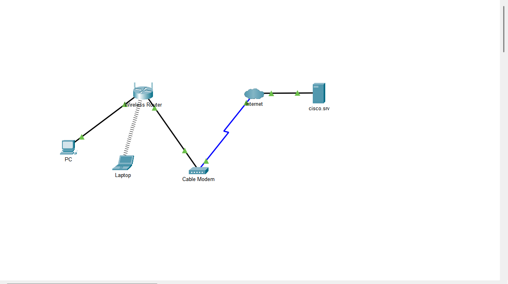

# Cisco Simple Network

This project demonstrates a basic network design built with **Cisco Packet Tracer**.  
It was created as part of my IT coursework to understand how devices communicate using routers, switches, and PCs.

## 🧱 Network Overview
- 2 PCs connected to 1 switch
- 1 router connecting to the switch
- Configured IP addresses and verified connectivity using `ping`

## 🖼️ Network Topology

## 🧰 Tools Used
- Cisco Packet Tracer
- Windows Command Prompt

## 📘 What I Learned
- How to assign IP addresses to interfaces
- How to connect devices using Ethernet cables
- How to use `ping` to test connectivity between hosts

 ⚠️ This lab was provided by Cisco Networking Academy as part of the Packet Tracer learning exercises.  
I completed and configured the network to demonstrate my understanding of basic network design and connectivity.

